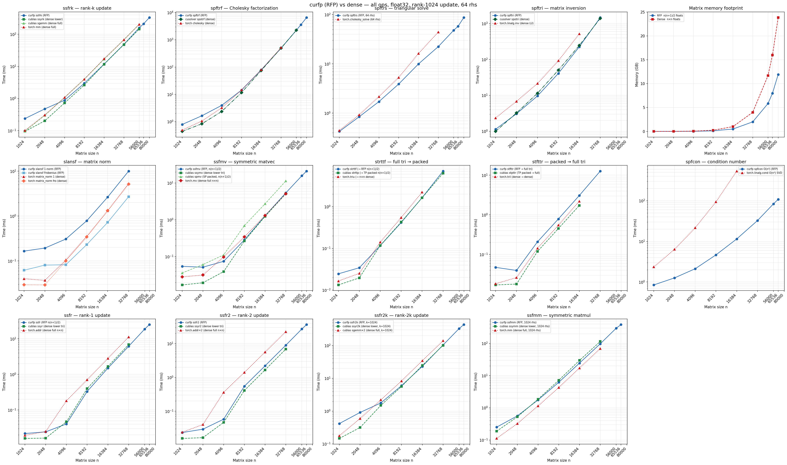

# curfp

CUDA implementation of RFP (Rectangular Full Packed) format matrix operations,
exposed as a PyTorch-friendly Python package.



*Benchmarked on RTX 5070 Ti (16 GB), float32, rank-1024 update + Cholesky + solve (64 rhs).
At n ≥ 56K the dense path runs out of memory while curfp continues to scale.*

## What is RFP format?

RFP stores a symmetric or triangular N×N matrix in exactly N×(N+1)/2 elements
arranged as a rectangle, avoiding the wasted space of full N×N storage while
still enabling Level 3 BLAS operations (no triangular loops). This means you
can fit **2× larger matrices** in GPU memory compared to dense storage, and
operate on matrices that would otherwise cause out-of-memory errors.

LAPACK uses this format in routines like `ssfrk`, `spftrf`, and `spftrs`.

## Operations

| Function | Description |
|---|---|
| `ssfrk` | Symmetric rank-k update: `C := alpha * A @ A.T + beta * C` (C in RFP) |
| `ssfr` | Symmetric rank-1 update: `C := alpha * x * x.T + C` (C in RFP) |
| `ssfr2` | Symmetric rank-2 update: `C := alpha * (x*y.T + y*x.T) + C` (C in RFP) |
| `ssfr2k` | Symmetric rank-2k update: `C := alpha*(A@B.T + B@A.T) + beta*C` (C in RFP) |
| `ssfmm` | Symmetric matrix-matrix multiply: `C := alpha*A*B + beta*C` or `C := alpha*B*A + beta*C` (A in RFP) |
| `ssfmv` | Symmetric matrix-vector multiply: `y := alpha * A * x + beta * y` (A in RFP) |
| `spftrf` | Cholesky factorization in-place: `A = L @ L.T` or `A = U.T @ U` (A in RFP) |
| `spftrs` | Triangular solve: `(L @ L.T) @ X = B` using the Cholesky factor from `spftrf` |
| `spftri` | Matrix inversion from Cholesky factor: `A := A^{-1}` in RFP |
| `slansf` | Norm of a symmetric matrix in RFP format: max-element, 1-norm, or Frobenius |
| `spfcon` | Condition number estimate from Cholesky factor: `rcond = 1 / (‖A⁻¹‖₁ · anorm)` |
| `strttf` | Convert a full triangular matrix to RFP format |
| `stfttr` | Convert an RFP matrix to full triangular format |
| `rfp_diag_indices` | Return flat indices of diagonal elements in the RFP array |
| `add_to_diagonal` | Add a scalar to every diagonal element (e.g. regularization) |

All operations support all 8 RFP storage variants (N/T transr × L/U uplo ×
odd/even N), are validated against NumPy/SciPy, and accept a CUDA stream for
asynchronous execution.

## Requirements

- CUDA toolkit (tested with CUDA 12)
- cuBLAS and cuSOLVER (included with CUDA toolkit)
- CMake >= 3.18
- Python >= 3.8
- [uv](https://docs.astral.sh/uv/)

## Install

```bash
git clone <repo-url>
cd curfp
make
```

This creates a `.venv` and installs the package (including `torch` and `pytest`)
into it. The C library and Python extension are built automatically via
[scikit-build-core](https://scikit-build-core.readthedocs.io/).

To use a different Python version:

```bash
make PYTHON_VER=3.12
```

To activate the venv for interactive use:

```bash
source .venv/bin/activate
```

Other useful targets:

```bash
make venv       # create .venv only
make test       # run Python tests (pytest)
make test-c     # C++ tests only (ctest)
make clean      # remove build artefacts
make distclean  # clean + remove .venv
```

## Quick start

```python
import torch
import curfp

n, k, nrhs = 4096, 128, 10

A = torch.randn(n, k, dtype=torch.float32, device="cuda") / k**0.5
C = torch.empty(n * (n + 1) // 2, dtype=torch.float32, device="cuda")
B = torch.randn(nrhs, n, dtype=torch.float32, device="cuda")

# Symmetric rank-k update: C = A @ A.T in RFP format
curfp.ssfrk(A, C)

# Regularize: C += I  (ensures positive definiteness)
curfp.add_to_diagonal(C, 1.0)

# Cholesky factorization in-place
curfp.spftrf(C)

# Solve (A @ A.T + I) @ X = B  in-place on B  (B is nrhs×n, rows are RHS)
curfp.spftrs(C, B)

# --- or: compute the explicit inverse ---
curfp.ssfrk(A, C)
curfp.add_to_diagonal(C, 1.0)
curfp.spftrf(C)
curfp.spftri(C)             # C now holds (A @ A.T + I)^{-1} in RFP

# --- rank-1 / rank-2 / rank-2k updates directly in RFP ---
x = torch.randn(n, dtype=torch.float32, device="cuda")
y = torch.randn(n, dtype=torch.float32, device="cuda")
curfp.ssfr(C, x)            # C += x * x.T  (in-place, no unpack)
curfp.ssfr2(C, x, y)        # C += x*y.T + y*x.T
curfp.ssfr2k(A, A, C, alpha=1.0, beta=1.0)   # C += A @ A.T (same as ssfrk)

# --- pack/unpack for interop with dense code ---
dense = torch.randn(n, n, dtype=torch.float32, device="cuda")
tri   = torch.triu(dense)
arf   = curfp.strttf(tri, uplo='U')     # dense upper triangle -> RFP
full  = curfp.stfttr(arf, uplo='U')     # RFP -> dense upper triangle
```

## Memory advantage

RFP stores only the triangle of a symmetric matrix, using half the memory:

| Matrix size | Dense (full N×N) | RFP (N×(N+1)/2) | Savings |
|-------------|-----------------|------------------|---------|
| 16,384 | 1.00 GB | 0.50 GB | 50% |
| 32,768 | 4.00 GB | 2.00 GB | 50% |
| 65,536 | 16.00 GB | 8.00 GB | 50% |

On a 16 GB GPU, dense Cholesky maxes out around n ≈ 40,000 (the matrix plus
cuSOLVER workspace exceed available memory). With curfp, you can handle
n ≈ 90,000 on the same GPU.

## API reference

### High-level API (recommended)

All high-level functions manage cuBLAS/cuSOLVER handles automatically
and infer dimensions from tensor shapes.

---

#### `curfp.ssfrk(A, C, *, alpha=1.0, beta=0.0, transr='T', uplo='U', trans='T', n=None, k=None, lda=None)`

Symmetric rank-k update directly into RFP-packed storage.

| Parameter | Type | Default | Description |
|---|---|---|---|
| `A` | `Tensor` | required | float32 CUDA, shape `(n, k)` for `trans='T'` |
| `C` | `Tensor` | required | float32 CUDA, `n*(n+1)//2` elements (RFP) |
| `alpha` | float | 1.0 | Scalar for `A @ A.T` |
| `beta` | float | 0.0 | Scalar for existing `C` |
| `transr` | str | `'T'` | RFP storage variant: `'N'` or `'T'` |
| `uplo` | str | `'U'` | Triangle stored: `'L'` or `'U'` |
| `trans` | str | `'T'` | `'T'`: `C = alpha * A @ A.T + beta*C`; column-major A for `'N'` |

---

#### `curfp.ssfr(arf, x, *, alpha=1.0, transr='T', uplo='U', n=None)`

Symmetric rank-1 update directly in RFP format: `arf := alpha * x * x.T + arf`.
Decomposes into 2× `cublasSsyr` + 1× `cublasSger` on the sub-blocks — no workspace,
no pack/unpack.

| Parameter | Type | Default | Description |
|---|---|---|---|
| `arf` | `Tensor` | required | float32 CUDA, `n*(n+1)//2` elements (RFP, in/out) |
| `x` | `Tensor` | required | float32 CUDA, length `n` |
| `alpha` | float | 1.0 | Scalar multiplier |
| `transr` | str | `'T'` | RFP storage variant |
| `uplo` | str | `'U'` | Triangle stored |

---

#### `curfp.ssfr2(arf, x, y, *, alpha=1.0, transr='T', uplo='U', n=None)`

Symmetric rank-2 update in RFP format: `arf := alpha * (x*y.T + y*x.T) + arf`.
Decomposes into 2× `cublasSsyr2` + 2× `cublasSger`.

| Parameter | Type | Default | Description |
|---|---|---|---|
| `arf` | `Tensor` | required | float32 CUDA, `n*(n+1)//2` elements (RFP, in/out) |
| `x` | `Tensor` | required | float32 CUDA, length `n` |
| `y` | `Tensor` | required | float32 CUDA, length `n` |
| `alpha` | float | 1.0 | Scalar multiplier |
| `transr` | str | `'T'` | RFP storage variant |
| `uplo` | str | `'U'` | Triangle stored |

---

#### `curfp.ssfr2k(A, B, C, *, alpha=1.0, beta=0.0, transr='T', uplo='U', trans='T', n=None, k=None, lda=None, ldb=None)`

Symmetric rank-2k update in RFP format:
`C := alpha*(A@B.T + B@A.T) + beta*C` (for `trans='T'` with row-major A, B of shape `(n, k)`).

Decomposes into 2× `cublasSsyr2k` + 2× `cublasSgemm`.

| Parameter | Type | Default | Description |
|---|---|---|---|
| `A` | `Tensor` | required | float32 CUDA, shape `(n, k)` for `trans='T'` |
| `B` | `Tensor` | required | float32 CUDA, same shape as `A` |
| `C` | `Tensor` | required | float32 CUDA, `n*(n+1)//2` elements (RFP, in/out) |
| `alpha` | float | 1.0 | Scalar for rank-2k term |
| `beta` | float | 0.0 | Scalar for existing `C` |
| `transr` | str | `'T'` | RFP storage variant |
| `uplo` | str | `'U'` | Triangle stored |
| `trans` | str | `'T'` | Operation on A and B; `'T'` for row-major arrays |

---

#### `curfp.ssfmv(arf, x, y=None, *, alpha=1.0, beta=0.0, transr='T', uplo='U', n=None) -> Tensor`

Symmetric matrix-vector multiply: `y := alpha * A * x + beta * y`.
Decomposes into 2× `cublasSsymv` + 2× `cublasSgemv` — no workspace allocation.

| Parameter | Type | Default | Description |
|---|---|---|---|
| `arf` | `Tensor` | required | float32 CUDA, `n*(n+1)//2` elements (RFP) |
| `x` | `Tensor` | required | float32 CUDA, length `n` |
| `y` | `Tensor` | `None` | float32 CUDA, length `n` (created as zeros if not given) |
| `alpha` | float | 1.0 | Scalar for `A * x` |
| `beta` | float | 0.0 | Scalar for existing `y` |
| `transr` | str | `'T'` | RFP storage variant |
| `uplo` | str | `'U'` | Triangle stored |

Returns the `y` tensor.

---

#### `curfp.spftrf(C, *, n=None, transr='T', uplo='U', check=True) -> int`

In-place Cholesky factorization of an RFP-packed symmetric positive definite matrix.

| Parameter | Type | Default | Description |
|---|---|---|---|
| `C` | `Tensor` | required | RFP matrix, overwritten with Cholesky factor |
| `n` | int | inferred | Matrix order |
| `transr` | str | `'T'` | Must match `ssfrk` |
| `uplo` | str | `'U'` | Must match `ssfrk` |
| `check` | bool | `True` | Raise `LinAlgError` if not positive definite |

Returns `info`: 0 = success, >0 = leading minor of that order is not positive definite.

---

#### `curfp.spftrs(C, B, *, n=None, nrhs=None, transr='T', uplo='U')`

Solve `A @ X = B` using the RFP Cholesky factor. `B` is overwritten with `X`.

`B` is expected to be `(nrhs, n)` row-major (rows are right-hand side vectors),
consistent with the row-major convention used throughout the library.

| Parameter | Type | Default | Description |
|---|---|---|---|
| `C` | `Tensor` | required | RFP Cholesky factor from `spftrf` |
| `B` | `Tensor` | required | float32 CUDA, `(nrhs, n)` — rows are RHS vectors, overwritten with solution |
| `n` | int | inferred | Matrix order |
| `nrhs` | int | inferred | Number of right-hand sides |
| `transr` | str | `'T'` | Must match previous calls |
| `uplo` | str | `'U'` | Must match previous calls |

---

#### `curfp.spftri(C, *, n=None, transr='T', uplo='U')`

Compute `A^{-1}` in-place from the RFP Cholesky factor produced by `spftrf`.
After this call `C` holds the inverse of the original SPD matrix in the same RFP
storage convention.

| Parameter | Type | Default | Description |
|---|---|---|---|
| `C` | `Tensor` | required | RFP Cholesky factor from `spftrf`, overwritten with `A^{-1}` |
| `n` | int | inferred | Matrix order |
| `transr` | str | `'T'` | Must match previous calls |
| `uplo` | str | `'U'` | Must match previous calls |

---

#### `curfp.slansf(C, norm='1', *, transr='T', uplo='U', n=None) -> float`

Compute a norm of a symmetric matrix stored in RFP format. Call this **before**
`spftrf` — the Cholesky factor does not represent the same symmetric matrix.

| Parameter | Type | Default | Description |
|---|---|---|---|
| `C` | `Tensor` | required | float32 CUDA, `n*(n+1)//2` elements (RFP) |
| `norm` | str | `'1'` | `'M'` max-element, `'1'`/`'O'`/`'I'` 1-norm, `'F'`/`'E'` Frobenius |
| `transr` | str | `'T'` | RFP storage variant |
| `uplo` | str | `'U'` | Triangle stored |

---

#### `curfp.spfcon(C, anorm, *, transr='T', uplo='U', n=None) -> float`

Estimate the reciprocal condition number from the RFP Cholesky factor.

| Parameter | Type | Default | Description |
|---|---|---|---|
| `C` | `Tensor` | required | RFP Cholesky factor from `spftrf` |
| `anorm` | float | required | 1-norm of the original matrix (from `slansf` before `spftrf`) |
| `transr` | str | `'T'` | Must match previous calls |
| `uplo` | str | `'U'` | Must match previous calls |

Returns `rcond`: reciprocal condition number. Near 1 = well-conditioned; near 0 = near-singular.

---

#### `curfp.strttf(A, *, transr='T', uplo='U', n=None) -> Tensor`

Convert a full triangular matrix to RFP format. Returns a new 1-D tensor of
size `n*(n+1)//2`.

| Parameter | Type | Default | Description |
|---|---|---|---|
| `A` | `Tensor` | required | float32 CUDA, shape `(n, n)` |
| `transr` | str | `'T'` | RFP storage variant for the output |
| `uplo` | str | `'U'` | Which triangle of `A` to read |

---

#### `curfp.stfttr(arf, *, transr='T', uplo='U', n=None) -> Tensor`

Convert an RFP matrix to full triangular format. Only the triangle specified
by `uplo` is written; the other triangle is zero.

| Parameter | Type | Default | Description |
|---|---|---|---|
| `arf` | `Tensor` | required | float32 CUDA, `n*(n+1)//2` elements (RFP) |
| `transr` | str | `'T'` | RFP storage variant |
| `uplo` | str | `'U'` | Which triangle to write in the output |

---

#### `curfp.rfp_diag_indices(n, transr='T', uplo='U', device=None) -> Tensor`

Return the flat indices of the `n` diagonal elements in the RFP array.
Useful for in-place diagonal modification without unpacking.

---

#### `curfp.add_to_diagonal(C, value, transr='T', uplo='U', n=None)`

Add a scalar to every diagonal element of an RFP-packed matrix.
Equivalent to `M += value * I` on the underlying symmetric matrix. Commonly
used for Tikhonov regularization before Cholesky factorization.

---

#### `curfp.set_stream(stream)`

Bind all curfp operations on the current device to a CUDA stream.
Pass `None` to revert to the default stream.

---

### `ssfmm` — symmetric matrix-matrix multiply

`ssfmm` is only available through the raw API because the row-major/column-major
convention requires explicit leading-dimension control.

```python
curfp.ssfmm_raw(handle, transr, uplo, side, m, n, alpha, arf, B, ldb, beta, C, ldc)
```

Computes:
- `side=SIDE_LEFT`:  `C := alpha * A * B + beta * C`  — A is m×m packed in `arf`
- `side=SIDE_RIGHT`: `C := alpha * B * A + beta * C`  — A is n×n packed in `arf`

**Row-major (PyTorch) calling convention:**

For both sides, the convention that maps naturally to row-major Python tensors
where each row is a sample vector is:

```python
# A (n_A × n_A) packed in arf
# B and C are (nrhs, n_A) row-major tensors

h = curfp.Handle()

# side=LEFT: C[i,:] = alpha*(A @ B[i,:]) + beta*C[i,:]
curfp.ssfmm_raw(h, curfp.OP_T, curfp.FILL_UPPER, curfp.SIDE_LEFT,
                n_A, nrhs, alpha, arf, B, n_A, beta, C, n_A)

# side=RIGHT: same result for symmetric A; pass B.T and C.T
B_T = B.T.contiguous()           # (n_A, nrhs)
C_T = torch.empty_like(B_T)
curfp.ssfmm_raw(h, curfp.OP_T, curfp.FILL_UPPER, curfp.SIDE_RIGHT,
                nrhs, n_A, alpha, arf, B_T, nrhs, beta, C_T, nrhs)
C = C_T.T.contiguous()           # (nrhs, n_A)
```

| Parameter | Type | Description |
|---|---|---|
| `handle` | `Handle` | curfp handle |
| `transr` | int | `OP_N` or `OP_T` |
| `uplo` | int | `FILL_LOWER` or `FILL_UPPER` |
| `side` | int | `SIDE_LEFT` or `SIDE_RIGHT` |
| `m` | int | Rows of B and C (use `n_A` for side=LEFT row-major convention) |
| `n` | int | Cols of B and C (use `nrhs` for side=LEFT row-major convention) |
| `alpha` | float | Scalar for matrix product |
| `arf` | `Tensor` | float32 CUDA, RFP-packed symmetric matrix |
| `B` | `Tensor` | float32 CUDA, dense input |
| `ldb` | int | Leading dimension of B (use `n_A` for side=LEFT) |
| `beta` | float | Scalar for existing C |
| `C` | `Tensor` | float32 CUDA, dense output (in/out) |
| `ldc` | int | Leading dimension of C (use `n_A` for side=LEFT) |

---

### Low-level API

All `_raw` functions accept explicit handle, integer enum constants, and leading
dimensions. Useful for fine-grained stream control or when building higher-level
abstractions.

```python
with curfp.Handle() as h:
    # Rank updates
    curfp.ssfrk_raw(h, curfp.OP_T, curfp.FILL_UPPER, curfp.OP_T,
                    n, k, 1.0, A, k, 0.0, C)
    curfp.ssfr2k_raw(h, curfp.OP_T, curfp.FILL_UPPER, curfp.OP_T,
                     n, k, 1.0, A, k, B, k, 1.0, C)
    curfp.ssfr_raw(h, curfp.OP_T, curfp.FILL_UPPER, n, 1.0, x, 1, C)
    curfp.ssfr2_raw(h, curfp.OP_T, curfp.FILL_UPPER, n, 1.0, x, 1, y, 1, C)

    # Matrix-matrix and matrix-vector multiply
    curfp.ssfmm_raw(h, curfp.OP_T, curfp.FILL_UPPER, curfp.SIDE_LEFT,
                    n, nrhs, 1.0, C, B, n, 0.0, out, n)
    curfp.ssfmv_raw(h, curfp.OP_T, curfp.FILL_UPPER, n,
                    1.0, arf, x, 1, 0.0, y, 1)

    # Cholesky pipeline
    anorm = curfp.slansf_raw(h, curfp.NORM_ONE, curfp.OP_T, curfp.FILL_UPPER, n, C)
    info  = curfp.spftrf_raw(h, curfp.OP_T, curfp.FILL_UPPER, n, C)
    curfp.spftrs_raw(h, curfp.OP_T, curfp.FILL_UPPER, n, nrhs, C, B, n)
    curfp.spftri_raw(h, curfp.OP_T, curfp.FILL_UPPER, n, C)
    rcond = curfp.spfcon_raw(h, curfp.OP_T, curfp.FILL_UPPER, n, C, anorm)

    # Format conversion
    curfp.strttf_raw(h, curfp.OP_T, curfp.FILL_UPPER, n, A, n, arf)
    curfp.stfttr_raw(h, curfp.OP_T, curfp.FILL_UPPER, n, arf, A, n)
```

### Constants

| Constant | Value | Meaning |
|---|---|---|
| `curfp.OP_N` | 0 | No transpose (TRANSR=N) |
| `curfp.OP_T` | 1 | Transpose (TRANSR=T, recommended default) |
| `curfp.FILL_LOWER` | 0 | Lower triangle |
| `curfp.FILL_UPPER` | 1 | Upper triangle (recommended default) |
| `curfp.NORM_MAX` | 0 | Max-element norm |
| `curfp.NORM_ONE` | 1 | 1-norm |
| `curfp.NORM_FRO` | 2 | Frobenius norm |
| `curfp.SIDE_LEFT` | 0 | A on left: `C = A*B` |
| `curfp.SIDE_RIGHT` | 1 | A on right: `C = B*A` |

## Implementation notes

### Sub-block decomposition

Every RFP operation decomposes the packed matrix into two symmetric diagonal
sub-blocks (T1, T2) and one rectangular off-diagonal block (S), then dispatches
cuBLAS/cuSOLVER calls on each sub-block. No scratch space is allocated by any
of the update or multiply operations.

| Function | cuBLAS/cuSOLVER calls |
|---|---|
| `ssfrk` | 2× `Ssyrk` + 1× `Sgemm` |
| `ssfr` | 2× `Ssyr` + 1× `Sger` |
| `ssfr2` | 2× `Ssyr2` + 2× `Sger` |
| `ssfr2k` | 2× `Ssyr2k` + 2× `Sgemm` |
| `ssfmm` | 2× `Ssymm` + 2× `Sgemm` |
| `ssfmv` | 2× `Ssymv` + 2× `Sgemv` |
| `spftrf` | `cusolverDnSpotrf` × 2 + `Strsm` + `Ssyrk` |
| `spftrs` | 4× `Strsm` + 2× `Sgemm` |
| `spftri` | `cusolverDnSpotri` × 2 + `Ssymm` + `Ssyrk` |
| `slansf` | `Isamax` (max) / 2D block-reduction kernels (1-norm) / `Snrm2` (Frobenius) |
| `strttf` / `stfttr` | Custom 2D CUDA kernel (one thread per element, O(1) index formula) |

### RFP storage variants

The 8 RFP storage variants arise from combinations of:
- `transr` ∈ {N, T} — whether the rectangular block is stored normally or transposed
- `uplo` ∈ {L, U} — which triangle the stored data represents
- n parity (even/odd) — which sub-block carries the extra row/column

The default `transr='T', uplo='U'` is recommended as it gives the best
cache behaviour for the majority of operations.

## Testing

All operations are validated against NumPy/SciPy for correctness across all 8
RFP storage variants, with matrix sizes from 1 to 128+ (both even and odd).

```bash
make test                                              # all Python tests (1610 total)
uv run pytest python_tests/test_vs_lapack.py           # ssfrk / spftrf / spftrs vs LAPACK
uv run pytest python_tests/test_stfttr_strttf.py       # format conversion
uv run pytest python_tests/test_spftri.py              # inversion vs numpy.linalg.inv
uv run pytest python_tests/test_ssfmv.py               # ssfmv vs numpy
uv run pytest python_tests/test_slansf.py              # norms vs numpy
uv run pytest python_tests/test_spfcon.py              # condition number vs scipy
uv run pytest python_tests/test_ssfr.py                # rank-1 update vs numpy
uv run pytest python_tests/test_ssfr2.py               # rank-2 update vs numpy
uv run pytest python_tests/test_ssfr2k.py              # rank-2k update vs numpy
uv run pytest python_tests/test_ssfmm.py               # symmetric matmul vs numpy
```
